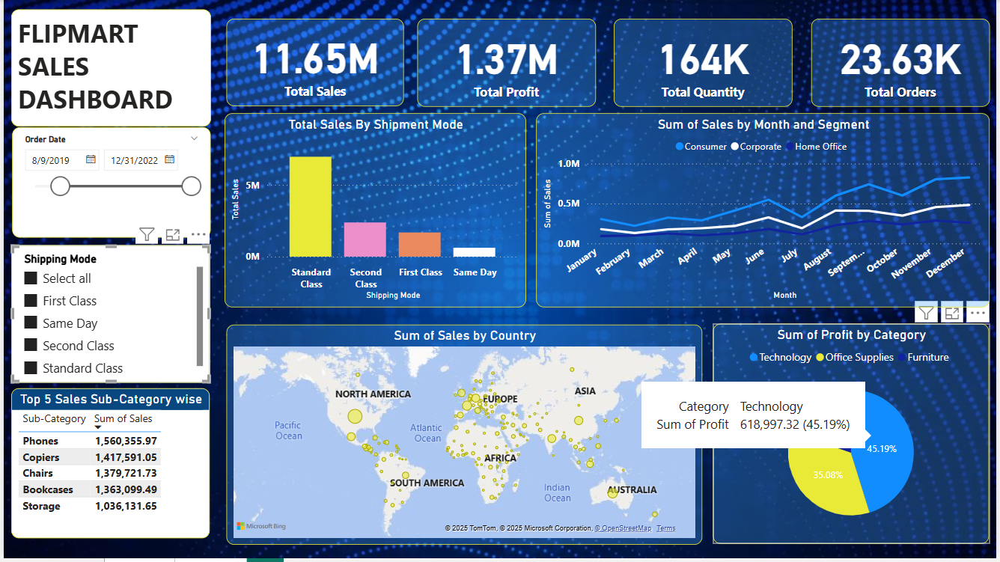

# 📊 Analytics Dashboards Portfolio

This repository contains interactive **Power BI dashboards** focused on **HR Analytics** and **Sales Performance Analysis**.  
Each dashboard is designed to provide actionable business insights through clear KPIs and visual storytelling.

---

## 🧑‍💼 HR Analytics Dashboard – Employee Attrition Analysis

### 📌 Overview
This dashboard analyzes employee attrition and workforce demographics to help HR teams identify retention risks and workforce trends.

### 🎯 Objectives
- Analyze overall employee attrition and attrition rate  
- Identify departments and job roles with high attrition  
- Understand attrition patterns by age group and gender  
- Examine the impact of education field on attrition  
- Assess job satisfaction levels across roles  

### 📈 Key KPIs
- **Total Employees:** 1470  
- **Attrition:** 237  
- **Attrition Rate:** 16.12%  
- **Active Employees:** 1233  
- **Average Age:** 37  

### 🔍 Key Insights
- Sales and R&D departments show the highest attrition  
- Employees aged **25–34** are most likely to leave  
- Job satisfaction strongly correlates with attrition  
- Attrition patterns vary by gender and age group  

---

## 🛒 Flipmart Sales Dashboard – Sales & Profit Analysis

### 📌 Overview
The **Flipmart Sales Dashboard** provides a comprehensive view of sales performance, profitability, shipping trends, and regional distribution across multiple customer segments.

### 🎯 Objectives
- Track overall sales, profit, orders, and quantity  
- Analyze sales by shipment mode and customer segment  
- Identify top-performing product sub-categories  
- Understand monthly sales trends  
- Visualize global sales distribution  

### 📈 Key KPIs
- **Total Sales:** 11.65M  
- **Total Profit:** 1.37M  
- **Total Quantity Sold:** 164K  
- **Total Orders:** 23.63K  

### 📊 Dashboard Features
- **Sales by Shipment Mode** (Standard, Second Class, First Class, Same Day)
- **Monthly Sales Trends** by segment (Consumer, Corporate, Home Office)
- **Top 5 Sub-Categories by Sales**
- **Sales by Country (Map Visualization)**
- **Profit by Category** (Technology, Office Supplies, Furniture)
- Interactive date and shipping filters

### 🔍 Key Insights
- Standard Class shipping contributes the highest sales  
- Technology category generates the highest profit share  
- Consumer segment dominates overall sales  
- Strong seasonal growth observed toward year-end  

---

## 🛠 Tools & Technologies
- **Power BI**
- Power Query (ETL & Data Cleaning)
- DAX (Calculated Measures & KPIs)

---

## 📌 Use Cases
- HR Attrition & Workforce Analysis  
- Sales Performance & Profitability Tracking  
- Business Decision Support  
- Executive & Management Reporting  

---

## ✅ Conclusion
These dashboards demonstrate the use of **data analytics and visualization** to transform raw data into meaningful business insights. Together, they highlight expertise in **Power BI, DAX, data modeling, and business analysis**.

---

## 🚀 Future Enhancements
- Predictive analytics (attrition & sales forecasting)  
- Advanced drill-through reports  
- Machine learning integration  
- Real-time data refresh  

---

## 👤 Author
**Aryan Jagani**  
Master’s Student – Information Systems  
University of Maryland, Baltimore County (UMBC)

- Data Visualization & Dashboard Design

---
