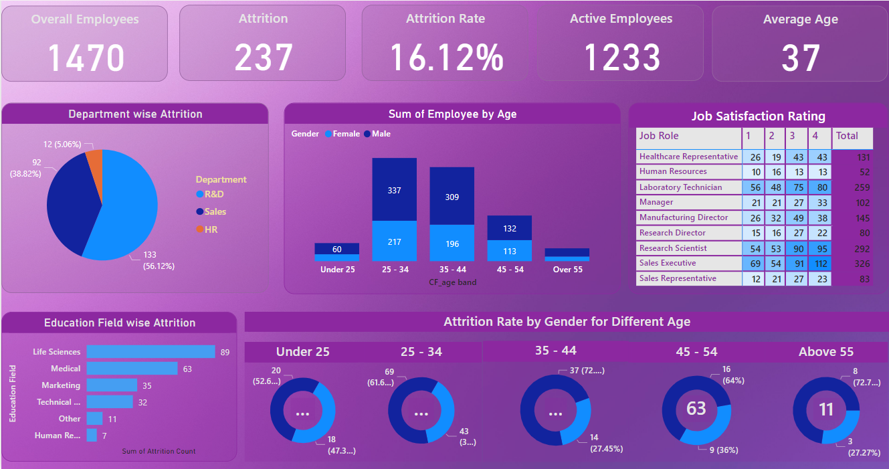

# 📊 HR Analytics Dashboard – Employee Attrition Analysis

## 📌 Project Overview
This project is an **HR Analytics Dashboard** developed using **Power BI** to analyze employee attrition and workforce demographics. The dashboard provides actionable insights into attrition trends across departments, age groups, gender, education fields, and job roles, helping HR teams make data-driven retention decisions.

---

## 🎯 Objectives
- Analyze overall employee attrition and attrition rate  
- Identify departments and job roles with high attrition  
- Understand attrition patterns by age group and gender  
- Examine the impact of education field on attrition  
- Assess job satisfaction levels across different roles  

---

## 📈 Key KPIs
- **Total Employees:** 1470  
- **Employees Left (Attrition):** 237  
- **Attrition Rate:** 16.12%  
- **Active Employees:** 1233  
- **Average Age:** 37  

---

## 🧩 Dashboard Features

### 🔹 Department-wise Attrition
- Visual breakdown of attrition across **R&D, Sales, and HR**
- Highlights departments with higher employee turnover

### 🔹 Employee Count by Age & Gender
- Age bands:  
  - Under 25  
  - 25–34  
  - 35–44  
  - 45–54  
  - Above 55  
- Gender-based workforce distribution

### 🔹 Job Satisfaction by Role
- Satisfaction ratings (1–4) for each job role
- Helps correlate low satisfaction with higher attrition

### 🔹 Education Field-wise Attrition
- Attrition comparison across education backgrounds:
  - Life Sciences  
  - Medical  
  - Marketing  
  - Technical  
  - Human Resources  
  - Other  

### 🔹 Attrition Rate by Gender & Age Group
- Donut charts showing gender-based attrition for each age band
- Identifies high-risk demographic groups

---

## 💡 Key Insights
- **Sales and R&D** departments experience the highest attrition  
- The **25–34 age group** shows the highest employee turnover  
- Employees from **Life Sciences and Medical** backgrounds have higher attrition  
- Certain job roles show lower satisfaction scores, contributing to attrition  
- Attrition trends differ across gender and age groups  

---

## 🛠 Tools & Technologies
- **Power BI**
- Power Query (Data Cleaning & Transformation)
- DAX (Measures & Calculated KPIs)
- Data Visualization & Dashboard Design

---

---

## 📌 Use Cases
- HR Attrition Analysis  
- Workforce Planning  
- Employee Retention Strategy  
- Management Reporting  

---

## ✅ Conclusion
This dashboard delivers a comprehensive view of employee attrition and workforce trends. By identifying key drivers of attrition, organizations can proactively improve employee satisfaction, retention, and overall workforce stability.

---

## 🚀 Future Enhancements
- Predictive attrition modeling using machine learning  
- Attrition analysis by tenure and performance rating  
- Drill-through analysis at department and role level  
- Integration with live HR databases  

---

## 📎 Author
**Aryan Jagani**  
Master’s Student – Information Systems  
University of Maryland, Baltimore County (UMBC)
